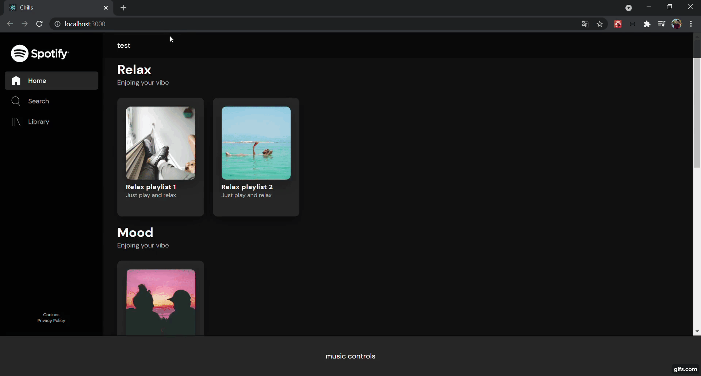

<h1 align="center">
    UI Spotify 
</h1>

  <a href="#-tecnologias">Tecnologias</a>&nbsp;&nbsp;&nbsp;|&nbsp;&nbsp;&nbsp;
  <a href="#-projeto">Projeto</a>&nbsp;&nbsp;&nbsp;|&nbsp;&nbsp;&nbsp;

 

Home

  

## 🚀 Tecnologias

Esse projeto foi desenvolvido com as seguintes tecnologias:

- TypeScript
- CSS (Styled-Components)
- ReactJS

## 💻 Projeto

Este projeto foi feito para melhorar minhas skills de programador em front-end, pretendo adicionar várias
implementações conforme for programando.
PS: Em desenvolvimento.